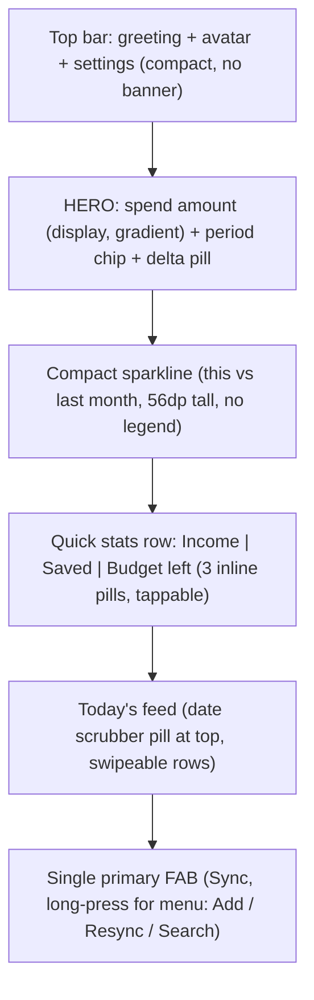

## Why redesign

Current [HomeScreen.kt](app/src/main/java/com/pennywiseai/tracker/presentation/home/HomeScreen.kt) stacks ~7 independent visual sections (cover banner, greeting, balance card with collapse/expand, quick actions, budgets carousel, loans, date navigator, feed, dual FABs). Eyes have nowhere obvious to land first; the BalanceCard alone has 8+ interactive controls (currency chip, hide toggle, pay-period toggle, expand chevron, sparkline, breakdown). This causes cognitive overload despite each piece being well-built.

## Design direction (modern fintech, low cognitive load)

Inspired by Revolut / Monzo / Cash App, prioritize:

- **One hero per screen** — spend this period is the only thing that matters above the fold
- **Glance first, drill on tap** — replace the expand/collapse pattern with peek-and-navigate
- **Bold typography hierarchy** — display weight for the number, everything else recedes
- **Colorful category pills, not gray rows** — borrowed from Monzo's category coins
- **Swipe gestures** — swipe-left on a transaction = exclude/delete (Cash App pattern)
- **Single primary action** — collapse dual FABs into one with a long-press menu
- **Progressive disclosure** — Loans/Budgets become tappable summary chips, not full cards

## Target layout

What's removed / merged from the current screen:

- Cover gradient banner + GreetingCard collapse into a slim top bar (saves ~180dp)
- BalanceCard expand/collapse → always-collapsed hero; sparkline becomes inline (no toggle)
- QuickActionItem strip → folded into the FAB long-press menu + the inline stat pills
- Budget carousel + Loans summary card → each becomes one inline stat pill that navigates on tap
- Dual FABs (Add + Sync) → single Sync FAB; long-press opens compact action menu

## Files to change

Surgical scope — primarily two files plus three small new components:

- [`HomeScreen.kt`](app/src/main/java/com/pennywiseai/tracker/presentation/home/HomeScreen.kt) — restructure `LazyColumn` items 1-3 and the FAB column; keep ViewModel, navigation, and all state logic untouched
- [`BalanceCard.kt`](app/src/main/java/com/pennywiseai/tracker/ui/components/cards/BalanceCard.kt) — replace with a leaner `HeroSpendCard` (always collapsed view). Keep file path/name to minimize diff; add a deprecation alias if needed. Remove the expand/collapse state, the inline summary row, and the sparkline legend.
- New `app/src/main/java/com/pennywiseai/tracker/ui/components/cards/StatPillRow.kt` — three horizontal pills (Income, Saved, Budget left) with semantic color dots, replacing the inline summary in `BalanceCard` and the standalone Loans/Budget cards
- New `app/src/main/java/com/pennywiseai/tracker/ui/components/cards/CompactSparkline.kt` — 56dp inline sparkline (this vs last month), no axis, no legend, single primary line + ghost line
- [`TransactionItem.kt`](app/src/main/java/com/pennywiseai/tracker/ui/components/cards/TransactionItem.kt) — wrap in `SwipeToDismissBox` (Material 3) for swipe-to-exclude (left) and swipe-to-delete (right). Existing `onExcludeToggle` / `onDelete` callbacks already exist — just wire them.
- [`CustomTitleTopAppBar.kt`](app/src/main/java/com/pennywiseai/tracker/ui/components/CustomTitleTopAppBar.kt) — drop the large `extraInfoCard` slot on Home (just title + actions). The cover banner becomes optional.

## Specific design choices (fintech low-cog-load)

- **Hero amount**: keep the existing `displaySmall` + `heroBrush` gradient from `BalanceCard.kt` lines 112-116. Move it to top-left aligned (not centered) — Monzo style. Remove the chevron, currency chip, and hide-toggle from the hero card; move hide-toggle to a long-press on the amount itself.
- **Period chip**: a single tappable pill below the amount: "September • Monthly". Tap opens a bottom sheet to change period type (calendar vs financial). This replaces the current `SpendingPeriodLabel` icon-button.
- **Delta pill**: "↓ 12% vs last month" — colored green when down, red when up (spending context). Already in current code at `BalanceCard.kt` line 122-123, just restyled with arrow glyph.
- **Stat pills row**: three pills with leading colored dots:
  - `● Income  ₹48k` (green dot)
  - `● Saved  ₹12k` (blue dot, navigates to Analytics)
  - `● Budget  ₹8k left` (amber/red dot, navigates to Budgets)
  This single row replaces both the budget carousel and the loans card. Loans surface as a 4th pill only when active.
- **Date scrubber**: keep existing `‹ Today ›` pill from `HomeScreen.kt` lines 583-633 — it's already good. Move "View all" to a small text link, drop the search icon button (search lives in FAB long-press).
- **Feed**: keep grouped-card pattern at `HomeScreen.kt` lines 736-768, but reduce row height ~10% (less vertical padding), add swipe gestures, and increase brand-icon size by 2dp for Cash-App-like glanceability.
- **FAB**: single circular FAB, primary color, bottom-right. Tap = sync. Long-press = small popup menu (Add transaction, Search, Full resync). Removes the dual-FAB column at `HomeScreen.kt` lines 794-842.

## Animation & motion

- Use existing entrance stagger (already at `HomeScreen.kt` lines 156-167) but reduce delays from 0/30/50/75/100/150ms to 0/40/80/120ms (4 sections instead of 7)
- Hero number: spring on amount changes (already animated via `AnimatedCurrencyText`)
- Pills: subtle scale-on-press (0.97f) using `Modifier.clickable` with `MutableInteractionSource`
- Swipe-to-action: standard Material 3 `SwipeToDismissBox` defaults

## Out of scope

- ViewModel / data layer changes — none required, all needed data already in `HomeUiState`
- Other screens (Transactions, Analytics, Add, Settings) — separate redesign passes per your earlier choice
- New dependencies — uses only existing Compose Material 3 + already-imported Haze
- Theme / color palette — uses existing semantic roles from [Theme.kt](app/src/main/java/com/pennywiseai/tracker/ui/theme/Theme.kt) and `income_*` / `expense_*` from [Color.kt](app/src/main/java/com/pennywiseai/tracker/ui/theme/Color.kt)

## Acceptance criteria

- Above-the-fold has exactly one display-weight number (the spend hero)
- Total interactive elements above the feed reduced from ~14 to ~8
- Removed sections (BudgetCarousel + Loans card + GreetingCard banner + ExpandedBalance + dual FABs) save an estimated 280-340dp of vertical space, surfacing 2-3 more transactions on first paint
- All existing functionality remains reachable (period toggle in sheet, breakdown via amount tap, currency switch in sheet, search/add via FAB long-press)
- No new gradle dependencies; no ViewModel signature changes
- Light/dark theme + dynamic color preserved